# 💼 Agentic Finance Crew

*A multi-agent **CrewAI** system that triages finance/ops expense requests — Intake → Policy Analyst → Approving Manager — with a deterministic policy guardrail and human-in-the-loop escalation.*

<p>
  
  
  
  
  
  
  
</p>

---

## 🎯 Problem

Finance teams drown in a high-volume, low-judgement task: reviewing expense and reimbursement requests. Most are small and compliant and *should* be auto-approved; a few breach policy, lack receipts, or are duplicates and need a human. Doing this by hand is slow and inconsistent — but handing it entirely to an LLM is unsafe, because **a model must never be the thing that authorizes spend**.

## 💡 Solution

A crew of three specialist AI agents that mirror a real finance back-office, wrapped around a **hard policy guardrail**:

| Agent | Responsibility |
|-------|----------------|
| 🧾 **Intake Officer** | Validates & normalizes each request; catches malformed/incomplete data early |
| 📊 **Policy Analyst** | Checks spend limits, receipt rules & duplicates; quantifies a 0–100 risk score |
| ✅ **Approving Manager** | Recommends `AUTO_APPROVED` / `NEEDS_HUMAN_REVIEW` / `REJECTED` with an auditable rationale |

The agents **explain and enrich** the decision; a deterministic rule engine **makes** it. The LLM can never approve something policy forbids — it can only reason about it. Anything risky is escalated to a human (the classic **human-in-the-loop** pattern).

## 🏗️ Architecture

```mermaid
flowchart TD
    A[Expense request<br/>API / CLI / batch] --> P[Pipeline]
    P --> F{Orchestrator factory<br/>Strategy pattern}
    F -->|ENGINE=crewai + key| C[CrewAIOrchestrator]
    F -->|ENGINE=langgraph| LG[LangGraphOrchestrator]
    F -->|default · no key| L[LocalOrchestrator]

    subgraph Crew["Shared 3-stage workflow"]
      S1[🧾 Intake<br/>validate + normalize]
      S2[📊 Policy Analyst<br/>violations · risk · duplicate]
      S3[✅ Approver<br/>recommend + explain]
    end

    C --> Crew
    LG --> Crew
    L --> Crew
    Crew --> G[[decide&#40;&#41; — policy guardrail]]
    G --> R1[Auto-approved]
    G --> R2[Human review queue]
    G --> R3[Rejected]

    T[(Shared deterministic tools<br/>policy · risk · duplicate)] -.-> S1 & S2 & S3
```



**The key design idea:** three interchangeable engines implement one `Orchestrator.process()` contract.

- **`CrewAIOrchestrator`** — the real multi-agent CrewAI crew (opt-in; needs an LLM key).
- **`LangGraphOrchestrator`** — the same workflow modeled as a **LangGraph** stateful graph (`START → intake → analyze → approve → END`); needs no LLM, so it's fully testable.
- **`LocalOrchestrator`** — a deterministic, zero-dependency engine that runs the *same* workflow with no LLM.

All three call the **same shared tools** for the hard rules, and all funnel through the **same `decide()` guardrail** — so they produce identical verdicts (verified by a parity test), differing only in *how* the workflow is orchestrated. Selecting between them is a runtime config choice (`ENGINE=...`), never a code change — so the demo, unit tests and CI run fully **without any API key**, while production can flip to the real crew with one environment variable.

## ✨ Key Features

- **Multi-agent orchestration** with CrewAI (sequential Intake → Analyst → Approver crew).
- **Policy-as-code guardrail** — spend limits, receipt rules, per-category limits and duplicate detection live in tested code, not in prompts.
- **Human-in-the-loop** routing for anything over-limit, non-compliant or high-risk.
- **Runs with zero secrets** via the local engine — great for demos, CI and offline dev.
- **FastAPI service** (`/approve`, `/approve/batch`, `/health`) with OpenAPI docs at `/docs`.
- **Fully containerized** (multi-stage, non-root, healthcheck) and **Kubernetes-ready**.
- **CI on every push** — tests across Python 3.10–3.12 + a Docker build/health check.

## 🧰 Tech Stack

**Python 3.11** · **CrewAI** (multi-agent) · **LangGraph** (state-graph) · **FastAPI** + **Uvicorn** · **Pydantic** · **Docker** (multi-stage) · **Kubernetes** · **GitHub Actions** · **pytest**

## 🧠 AI / Engineering Decisions

- **The model advises; policy decides.** Keeping authorization in a deterministic `decide()` function makes the system auditable and safe to run unattended — a non-negotiable in finance.
- **Strategy pattern for the engine.** The LLM is an *optional, swappable* dependency. This makes the whole system testable and runnable with no key, and avoids vendor lock-in (OpenAI or Gemini via config).
- **Rules in code, not prompts.** Spend limits and receipt policy are unit-tested pure functions, so behavior is reproducible and doesn't drift with model updates.
- **Human-in-the-loop by default** for risk — the crew optimizes throughput on the safe majority without ever silently approving the risky minority.

## 📈 Results (demo run)

Running the bundled fictional batch (`python run_demo.py`) over 8 requests:

```
[APPROVED]  EXP-1001   risk=  4  Auto-approved: $149.00 within $200.00 limit, compliant, low risk.
[APPROVED]  EXP-1002   risk= 25  Auto-approved: $85.00 within $200.00 limit, compliant, low risk.
[REVIEW]    EXP-1003   risk= 29  Compliant but $1,450.00 exceeds the $200.00 auto-approve limit.
[REVIEW]    EXP-1004   risk= 45  amount over $2,000.00 always needs human sign-off.
[REVIEW]    EXP-1005   risk=100  exceeds meals limit; receipt required over $50.00.
[REJECTED]  EXP-1006   risk=  0  failed intake validation: amount must be positive.
[REVIEW]    EXP-1007   risk= 31  receipt required for amounts over $50.00.
[REVIEW]    EXP-1008   risk= 19  possible duplicate of an earlier request.

8 processed | 2 auto-approved | 5 to human | 1 rejected
```

## 🚀 Quickstart

```bash
git clone https://github.com/furqunali/agentic-finance-crew.git
cd agentic-finance-crew
pip install -e ".[dev]"

python run_demo.py          # run the crew over the sample batch (no key needed)
pytest -q                   # 15 tests, all green
uvicorn app:app --reload    # API at http://localhost:8000/docs
```

### 🐳 Docker

```bash
docker compose up --build   # API on http://localhost:8000
# or:
docker build -t agentic-finance-crew .
docker run -p 8000:8000 agentic-finance-crew
```

### ☸️ Kubernetes

```bash
kubectl apply -f k8s/        # Deployment (2 replicas, probes, non-root) + Service
```

### 🔀 Choosing an engine

Set `ENGINE` (all produce identical verdicts — they differ only in orchestration):

```bash
ENGINE=local      python run_demo.py     # deterministic, no deps, no key (default)
ENGINE=langgraph  python run_demo.py     # LangGraph state graph (pip install -e ".[langgraph]")
ENGINE=crewai     python run_demo.py     # real CrewAI crew (needs a key, see below)
```

### 🤖 Enable the real CrewAI crew

```bash
cp .env.example .env         # set USE_CREWAI=true and your OPENAI_API_KEY / GEMINI_API_KEY
pip install -e ".[crewai]"
```

## 🔒 Security & Data

- **No secrets in code or images** — every key is read from the environment; `.env` is gitignored, only `.env.example` (placeholders) is tracked. K8s manifests reference a `Secret`, not plain values.
- **Runs as a non-root container user**; image is a slim multi-stage build.
- **Fully synthetic data** — `sample_data/expenses.json` contains fictional employees and amounts only. No real financial data.

## 🗺️ Roadmap

- ✅ **LangGraph** orchestrator as a third interchangeable engine (stateful graph) — *done*.
- Persist the human-review queue + decisions to Postgres as a system-of-record.
- Add **eval cases** scoring the crew's rationale quality against the deterministic ground truth.
- Slack / email approval actions for the human-in-the-loop step.
- Deploy the FastAPI service (runs key-free in local mode) as a public live demo.

---

<sub>Built by <b>Furqan Ali</b> — Senior AI Engineer. Architecture, agent design and DevOps by the author. Data is fully synthetic.</sub>
